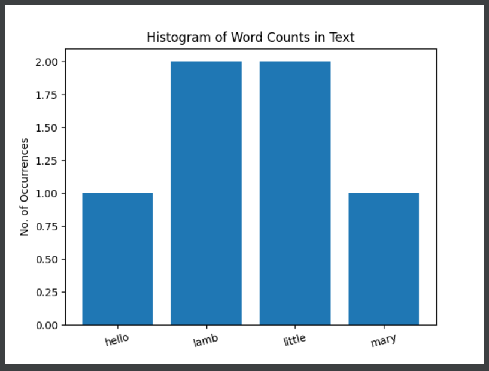
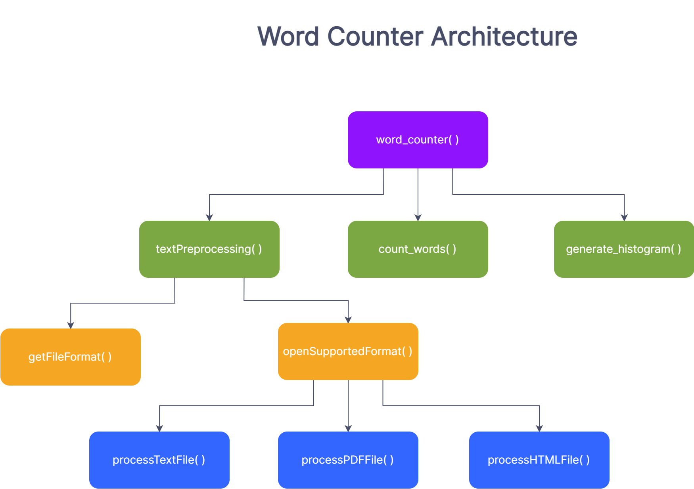

# Word Counter by Santiago Gomez
Welcome! Willkommen! Bienvenidos!

word-analyzer-ci-sgomez14
word-analyzer-ci-sgomez14 created by GitHub Classroom

## Description

word_counter.py provides a module that enables users to count the words in their documents and display a histogram showing the occurrence of each word.

Currently, word_counter supports .txt and .html. PDF support is in development since their are some dependency issues.

## Using word_counter

The module provides a frontend function called word_counter(). This function takes two arguments: the file path as a string, and a boolean option to display the histogram.

The function is word_counter(file, display_histogram=False). The first argument is required and the second is optional. By default, the function does not display the histogram.
To display the histogram, a user must provide True as the second argument.

In your code do the following:

from word_counter import word_counter

Then you can utilize word_counter() anywhere in your application.

## Sample Results

The histogram displays each other in ascending order along the x-axis and the number of occerences along the y-axis.

Figure 1: Sample Histogram 1

## Module Architecture

The flowchart below outlines the structure of the Word Counter module.

Figure 2: Module Architecture v1 for Word Counter

## Release Notes

### Version 1.0

 - This version strips away all punctuation, including apostrophes in words.
 - Currently, not detecting compounds words separated by space. Space-separated words are broken
   into their constituent components
 - Numbers are considered for in the word count. Different technology would be needed to analzye
   the intent of numbers in a text.
 - Foreign words are counted in the text, since it is possible that the author of the text wanted 
   to inject foreign words.
 

 

